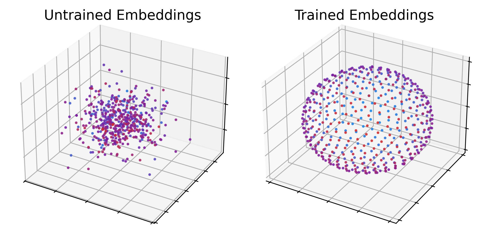

# Separate, Project, and Amplify: Attention's Geometry of Retrieval
[](https://doi.org/10.5281/zenodo.19422845)
[](https://opensource.org/licenses/MIT)


*A $d_k=3$ model rearranges 512 symbol embeddings from a point cloud to a sphere with 7.5 to 20 degrees of separation between vectors.*


**TL;DR:** By decoupling positional confounds, we demonstrate that attention's retrieval capacity is purely geometric and unconstrained by head dimension. Using our Tuple-Structured Associative Recall (TSAR) framework, **a 1-layer Transformer achieves perfect associative recall on 16K-assignment sequences with a head dimension of only $d_k=6$ and training on sequences of no more than 1K assignments.**

This repository contains the minimal model, the TSAR synthetic task, and the complete reproduction code for the paper: ["Separate, Project, and Amplify: Attention's Geometry of Retrieval"](https://zenodo.org/records/19422845).

## Quickstart & Usage

This software requires Python 3.12+. Setting up an isolated environment (venv, conda) is recommended.

### Installation

```bash
git clone https://github.com/tmaselko/paper-attncap
cd paper-attncap
pip install -r requirements.txt
```

There are several ways to run the reproduction, depending on your time and interest. The script can be stopped at any time and re-runs will automatically resume from where it left off, reusing previous work. The repro script stores its current progress in a `models` folder, and places charts/tables in a `charts` folder.

### Reproduce: Headlines Only

Default mode. Only performs a few of the "most relevant" experiments (trains dk=[3, 6, 8, 16] until successful and then tests all model constructions). This will attempt to generate an embedding rendering like the one seen above and some of the mechinterp charts/tables seen in the paper.

Requirements: About five minutes on a 4090 and a few megabytes of storage.

```bash
python -m src.repro
```

### Reproduce: One of Each

Trains one of each model variant and size, including ablations. Produces all charts and figures in the paper, but without the repeated samples for statistical significance.

Requirements: About two hours on a 4090 and about 15gb of storage.

```bash
python -m src.repro --short
```

### Reproduce: The Entire Paper

Reproduces all the graphs and figures in the paper, including up to 20 training and testing runs for each of the hundreds of model variants.

Requirements: 20-30 hours on a 4090 and about 160gb of storage.

```bash
python -m src.repro --all
```
